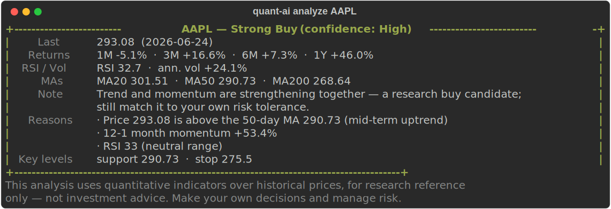

# quant.ai

> **Quant research for US stocks, built to live inside your AI assistant.**
> Plug it into **Claude or Codex** via [MCP](https://modelcontextprotocol.io) and ask about any ticker — get explainable ratings, key levels, and the reasoning, then *discuss it in the same chat*. Also works as a one-command CLI.

[English](README.md) | [中文](README_CN.md)

[](https://github.com/TingdeLiu/quant.ai/actions/workflows/ci.yml)
[](LICENSE)
[](https://www.python.org/)

`quant.ai` is a command-line quant-research toolkit for **US equities**, built for everyday investors. Type one command and get an explainable rating, key support/stop levels, and the reasoning behind them — all derived from historical prices, fully offline-friendly, and with no brokerage attached.

> ⚠️ Research only — **not investment advice**. It never places or suggests live orders.
> Output is **English by default**; add `--lang zh` (or pick at `quant-ai init`) for Chinese (中文).

## Quick start

```bash
pip install -e .          # or: pip install -r requirements.txt
quant-ai doctor           # environment self-check (deps + data connectivity)
quant-ai analyze AAPL     # rate one stock in seconds
```

No entry point? `python -m quant_agent analyze AAPL` works the same.

## What you get



Real output from `quant-ai analyze AAPL` — **English by default**, `--lang zh` for Chinese. Ratings range from **Strong Buy** through **Neutral** to **Strong Sell**. Add `--output-dir` to export Markdown + JSON, or `--chart` for a PNG chart.

## Use it inside Claude or Codex

The headline feature — expose quant.ai as an [MCP](https://modelcontextprotocol.io) server and let your AI assistant call it:

```bash
claude mcp add quant-research -- python -m quant_agent.mcp_server
```

Then just ask, in the same chat where you work:

> *"What's the read on NVDA?"*  ·  *"Any long-term buy candidates today?"*  ·  *"Compare AAPL and MSFT."*

Claude (or Codex) calls into real project data, shows you the quant analysis, and you discuss it inline — no separate website, no copy-pasting. See [README_CN.md](README_CN.md#集成到-claudemcp) for Claude Desktop / Codex config.

## Highlights

- 🤖 **Lives inside your AI assistant — the headline feature.** Plug the built-in MCP server into **Claude or Codex** and ask *"what's the read on NVDA?"* It pulls real quant analysis from this project, so you **see the analysis and discuss it in one conversation**. Most stock-analysis tools are standalone websites — this one is embedded in the AI you already chat with.
- 🎯 **Zero-config single-stock analysis** — `analyze AAPL` returns rating, returns, RSI, volatility, MA positions, support/stop levels, and human-readable reasons.
- 🧩 **Personalized watchlist** — `quant-ai init` builds a universe that is **2/3 your own picks** (companies + sectors you care about) and **1/3 discovered** by the engine from the wider market.
- 🔬 **Research backtests** — cross-sectional signals (12-1 momentum, 20/50 trend, 1-month reversal, low-vol), signal-weight search, **walk-forward** stability analysis, plus SPY and equal-weight baselines to separate alpha from beta.
- 📊 **Local dashboard & daily market report** — a no-key market-intelligence brief and an interactive Markets dashboard, served locally.
- 🛡️ **Safe by design** — deterministic signals + risk layer, friendly degradation on network/data errors, paper trading only — never submits real orders.

## Common commands

| Command | What it does |
| --- | --- |
| `quant-ai analyze AAPL MSFT NVDA` | Rate one or more stocks |
| `quant-ai analyze --file watchlist.txt` | Rate symbols from a file |
| `quant-ai init` | Build a personalized watchlist (interactive) |
| `quant-ai analyze --watchlist` | Rate your personalized watchlist |
| `quant-ai run-backtest --config configs/default.yaml` | Run the research backtest |
| `quant-ai market-report` | Generate the daily market-intel report |
| `quant-ai serve-dashboard` | Start the local dashboard service |
| `quant-ai doctor` | Environment self-check |

## How it works

1. **Data** — daily OHLCV from Yahoo Finance (`yfinance`) by default, or local CSV/Parquet. Cached and validated.
2. **Signals** — cross-sectional, point-in-time-lagged factors, z-scored per day.
3. **Portfolio & risk** — deterministic target weights under position/turnover/liquidity limits.
4. **Evaluation** — train / validation / test split, walk-forward windows, and benchmark-relative metrics (Sharpe, Sortino, Calmar, max drawdown, alpha/beta).
5. **AI (optional)** — an LLM only *reviews* and *narrates* research; it never generates orders. Falls back to an offline template when no API key is set.

## Documentation

- **Full manual (Chinese):** [README_CN.md](README_CN.md) — detailed config, backtest/walk-forward, dashboard API, MCP integration, output files.
- **Changelog:** [CHANGELOG.md](CHANGELOG.md) · **Contributing:** [CONTRIBUTING.md](CONTRIBUTING.md) · **Roadmap:** [roadmap.md](roadmap.md)

## Tests

```bash
python -m pytest      # 47 tests, network-free
python -m ruff check quant_agent tests conftest.py
```

## Disclaimer

This project is for **quantitative research and education only**. It analyzes historical prices and produces research signals — **not investment advice**, and **not** authorization to trade. Markets carry risk; you are responsible for your own decisions.

## License

[MIT](LICENSE)
