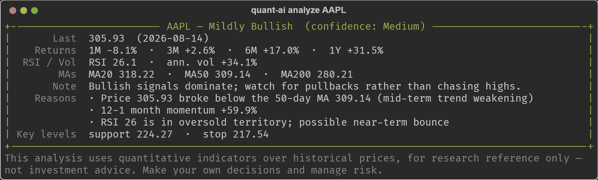
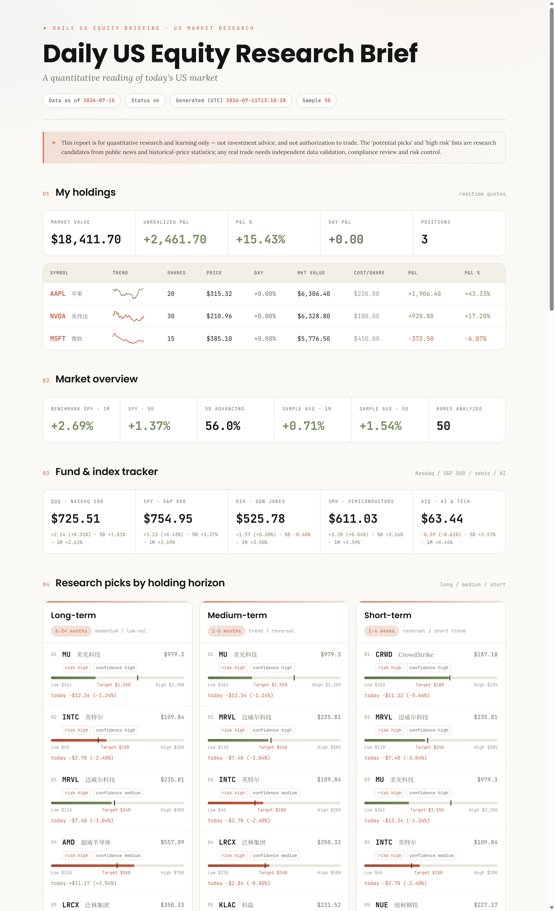
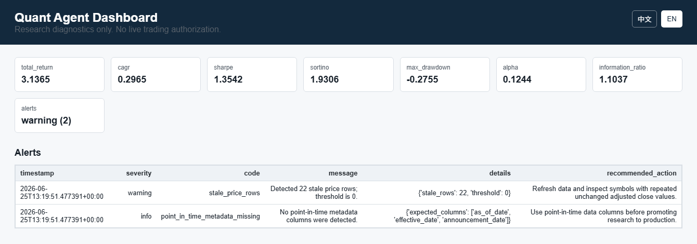

# quant.ai

> **Quant research for US stocks, built to live inside your AI assistant.**
> Plug it into **Claude or Codex** via [MCP](https://modelcontextprotocol.io) and ask about any ticker — get explainable ratings, key levels, and the reasoning, then *discuss it in the same chat*. Also works as a one-command CLI.

English | [中文](README_CN.md)

[](https://github.com/TingdeLiu/quant.ai/actions/workflows/ci.yml)
[](LICENSE)
[](https://www.python.org/)

`quant.ai` is a command-line quant-research toolkit for **US equities**, built for everyday investors. Type one command and get an explainable rating, key support/stop levels, and the reasoning behind them — all derived from historical prices, fully offline-friendly, and with no brokerage attached.

> ⚠️ Research only — **not investment advice**. It never places or suggests live orders.
> Output is **English by default**; add `--lang zh` (or pick at `quant-ai init`) for Chinese (中文).

## Quick start

```bash
pip install -e .          # or: pip install -r requirements.txt
quant-ai doctor           # environment self-check (deps + data connectivity)
quant-ai analyze AAPL     # rate one stock in seconds
```

No entry point? `python -m quant_agent analyze AAPL` works the same.

## What you get



Real output from `quant-ai analyze AAPL` — **English by default**, `--lang zh` for Chinese. Ratings range from **Strong Buy** through **Neutral** to **Strong Sell**. Add `--output-dir` to export Markdown + JSON, or `--chart` for a PNG chart.

## Use it inside Claude or Codex

The headline feature — expose quant.ai as an [MCP](https://modelcontextprotocol.io) server and let your AI assistant call it:

```bash
claude mcp add quant-research -- python -m quant_agent.mcp_server
```

Then just ask, in the same chat where you work:

> *"What's the read on NVDA?"*  ·  *"Watch TSLA for me."*  ·  *"I bought 15 AAPL at 182.5 — track it."*  ·  *"How are my positions doing?"*  ·  *"Generate today's market report."*

Claude (or Codex) calls into real project data, shows you the quant analysis, and you discuss it inline — no separate website, no copy-pasting. The daily report opens with **your holdings P&L** and renders as a polished **HTML artifact**. See the [manual](docs/manual_zh.md#集成到-claudemcp) (Chinese) for Claude Desktop / Codex config.

**Let your AI assistant install it** — paste this into Claude Code (or any AI CLI) and it can set everything up:

```text
Install https://github.com/TingdeLiu/quant.ai as an MCP server:
1. git clone https://github.com/TingdeLiu/quant.ai && cd quant.ai
2. pip install -e .
3. claude mcp add quant-research -- python -m quant_agent.mcp_server
4. Verify: `claude mcp list` should show quant-research ✓ connected
```

## Highlights

- 🤖 **Lives inside your AI assistant — the headline feature.** Plug the built-in MCP server into **Claude or Codex** and ask *"what's the read on NVDA?"* It pulls real quant analysis from this project, so you **see the analysis and discuss it in one conversation**. Most stock-analysis tools are standalone websites — this one is embedded in the AI you already chat with.
- 💼 **Your watchlist & holdings, managed by chat.** Tell Claude *"watch NVDA"* or *"I bought 15 AAPL at 182.5"* — they persist locally in `data/portfolio.json`, are folded into every analysis automatically, and the daily report **opens with your positions and unrealized P&L** (best-effort live quotes, falling back to last close).
- 🖼️ **Artifact-ready daily report** — the market brief ships as a self-contained light/dark HTML file that Claude renders as an inline artifact; Markdown and JSON are written alongside for everything else.
- 🎯 **Zero-config single-stock analysis** — `analyze AAPL` returns rating, returns, RSI, volatility, MA positions, support/stop levels, and human-readable reasons.
- 🧩 **Personalized watchlist** — `quant-ai init` builds a universe that is **2/3 your own picks** (companies + sectors you care about) and **1/3 discovered** by the engine from the wider market.
- 🔬 **Research backtests** — cross-sectional signals (12-1 momentum, 20/50 trend, 1-month reversal, low-vol), signal-weight search, **walk-forward** stability analysis, plus SPY and equal-weight baselines to separate alpha from beta.
- 📊 **Local dashboard & daily market report** — a no-key market-intelligence brief and an interactive Markets dashboard, served locally.
- 🛡️ **Safe by design** — deterministic signals + risk layer, friendly degradation on network/data errors, paper trading only — never submits real orders.

## Daily market report & dashboard

`quant-ai market-report` builds a daily US-equity research brief — your holdings P&L (with a per-position sparkline), a **per-holding profile card** for every position, market overview, a fund/index tracker (Nasdaq 100 / S&P 500 / semis / AI), potential-picks / high-risk lists, quant picks by holding horizon (Chinese name, analyst valuation-range bar, day change, held positions pinned to the top), and free news headlines — in an Anthropic-style design, written as HTML + a self-contained artifact + Markdown + JSON:



Right under the P&L table, **Holdings at a glance** gives each position its own card: portfolio weight, trend state, 5D/1M/3M returns, annualized volatility, 1-year max drawdown, distance from the 52-week high, strength against the benchmark, the sell-side analyst range, where it stands in the quant lists, its recent headlines, and a click-to-expand 1W–5Y close chart.

That section deliberately stops at the facts. It carries **no buy/sell call and no price forecast** — a test asserts the wording never drifts. This is a research tool, not a licensed adviser: it lays out the evidence and leaves the decision to you.

The per-holding news blurbs are **hand-written and read from `data/news_digest.json`** (`{as_of, digests: {SYMBOL: "one line"}}`) — the project never calls an LLM API for them. When that file's `as_of` is older than the report's data date, each card is stamped "digest as of …", so a stale summary can't pass itself off as today's.

`quant-ai serve-dashboard` (or `write-dashboard`) renders backtest diagnostics — headline metrics, alerts, period breakdown, risk checks, positions and trades — with a built-in **EN / 中文** toggle:



## Common commands

| Command | What it does |
| --- | --- |
| `quant-ai analyze AAPL MSFT NVDA` | Rate one or more stocks |
| `quant-ai analyze --file watchlist.txt` | Rate symbols from a file |
| `quant-ai init` | Build a personalized watchlist (interactive) |
| `quant-ai analyze --watchlist` | Rate your personalized watchlist |
| `quant-ai run-backtest --config configs/default.yaml` | Run the research backtest |
| `quant-ai market-report` | Generate the daily market-intel report |
| `quant-ai serve-dashboard` | Start the local dashboard service |
| `quant-ai doctor` | Environment self-check |

## How it works

1. **Data** — daily OHLCV from Yahoo Finance (`yfinance`) by default, or local CSV/Parquet. Cached and validated.
2. **Signals** — cross-sectional, point-in-time-lagged factors, z-scored per day.
3. **Portfolio & risk** — deterministic target weights under position/turnover/liquidity limits.
4. **Evaluation** — train / validation / test split, walk-forward windows, and benchmark-relative metrics (Sharpe, Sortino, Calmar, max drawdown, alpha/beta).
5. **AI (optional)** — an LLM only *reviews* and *narrates* research; it never generates orders. Falls back to an offline template when no API key is set.

## Documentation

- **Full manual (Chinese):** [docs/manual_zh.md](docs/manual_zh.md) — detailed config, backtest/walk-forward, dashboard API, MCP integration, output files.
- **Changelog:** [CHANGELOG.md](CHANGELOG.md) · **Contributing:** [CONTRIBUTING.md](CONTRIBUTING.md) · **Roadmap:** [roadmap.md](roadmap.md)

## Tests

```bash
python -m pytest      # 72 tests, network-free
python -m ruff check quant_agent tests conftest.py
```

## Disclaimer

This project is for **quantitative research and education only**. It analyzes historical prices and produces research signals — **not investment advice**, and **not** authorization to trade. Markets carry risk; you are responsible for your own decisions.

## License

[MIT](LICENSE)
