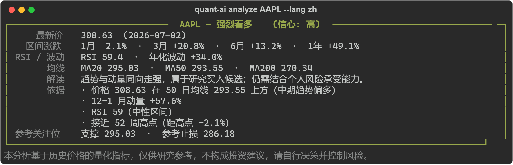
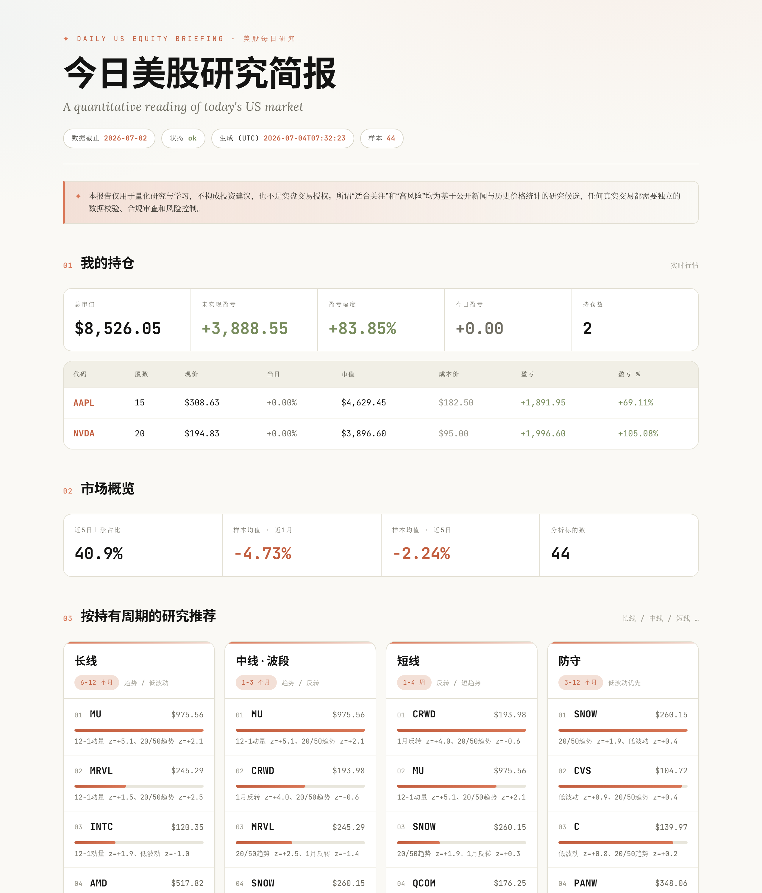

# quant.ai

> **长在你 AI 助手里的美股量化研究工具。**
> 通过 [MCP](https://modelcontextprotocol.io) 接入 **Claude 或 Codex**，随口问任何一只股票——拿到可解释的评级、关键价位和判断依据，然后*就在同一个对话里继续讨论*。也可以当作一行命令的 CLI 使用。

[English](README.md) | 中文

[](https://github.com/TingdeLiu/quant.ai/actions/workflows/ci.yml)
[](LICENSE)
[](https://www.python.org/)

`quant.ai` 是一个面向普通投资者的美股命令行量化研究工具箱。一行命令即可得到可解释的评级、支撑/止损参考位与判断依据——全部由历史价格计算，离线友好，不接任何券商。

> ⚠️ 仅供研究——**不构成投资建议**，永远不会提交或建议实盘订单。
> 输出**默认英文**；加 `--lang zh`（或在 `quant-ai init` 时选择）切换中文。

## 快速开始

```bash
pip install -e .          # 或：pip install -r requirements.txt
quant-ai doctor           # 环境自检（依赖 + 数据连通性）
quant-ai analyze AAPL     # 秒级评级一只股票
```

没有命令入口？`python -m quant_agent analyze AAPL` 效果相同。

## 你会得到什么



`quant-ai analyze AAPL --lang zh` 的真实输出——**默认英文**，`--lang zh` 切中文。评级从**强烈看多**经**中性**到**强烈看空**。加 `--output-dir` 导出 Markdown + JSON，或 `--chart` 输出 PNG 图表。

## 在 Claude 或 Codex 里使用

头号特性——把 quant.ai 暴露为 [MCP](https://modelcontextprotocol.io) server，让你的 AI 助手直接调用：

```bash
claude mcp add quant-research -- python -m quant_agent.mcp_server
```

然后在你日常工作的对话里直接问：

> *「NVDA 现在怎么看？」* · *「帮我关注特斯拉」* · *「我 182.5 买了 15 股苹果，帮我记着」* · *「我的持仓怎么样了？」* · *「生成今日美股报告」*

Claude（或 Codex）会调取项目的真实数据，把量化分析摆在你面前，你就地讨论——不用开网站，不用复制粘贴。每日报告**以你的持仓盈亏开篇**，并渲染成精致的 **HTML artifact**。Claude Desktop / Codex 配置详见[中文手册](docs/manual_zh.md#集成到-claudemcp)。

**让 AI 替你安装**——把下面这段丢给 Claude Code（或任何 AI CLI）即可搞定一切：

```text
把 https://github.com/TingdeLiu/quant.ai 安装为 MCP server：
1. git clone https://github.com/TingdeLiu/quant.ai && cd quant.ai
2. pip install -e .
3. claude mcp add quant-research -- python -m quant_agent.mcp_server
4. 用 `claude mcp list` 验证（应显示 quant-research ✓ connected）
```

## 亮点

- 🤖 **住在你的 AI 助手里——头号特性。** 把内置 MCP server 接进 **Claude 或 Codex**，问一句*「NVDA 现在怎么看？」*，它就会调取本项目的真实量化分析——**看结果和聊分析在同一个对话里完成**。多数股票分析工具是独立网站，这一个直接嵌在你天天在用的 AI 里。
- 💼 **对话管理自选与持仓。** 对 Claude 说*「帮我关注 NVDA」*或*「我 182.5 买了 15 股苹果」*——数据存在本地 `data/portfolio.json`，自动并入每一次分析，每日报告**以你的持仓与未实现盈亏开篇**（尽力取实时报价，降级用上一收盘价）。
- 🖼️ **Artifact 级每日报告**——市场简报以自包含、明暗双主题的 HTML 文件产出，Claude 直接渲染为内嵌 artifact；同时写出 Markdown 和 JSON 以备他用。
- 🎯 **零配置个股分析**——`analyze AAPL` 返回评级、区间收益、RSI、波动率、均线位置、支撑/止损参考位和人话版判断依据。
- 🧩 **个性化股票池**——`quant-ai init` 生成的股票池 **2/3 来自你的自选**（你关心的公司 + 板块），**1/3 由引擎**从更大的市场中发现。
- 🔬 **研究级回测**——横截面信号（12-1 动量、20/50 趋势、1 月反转、低波动）、信号权重搜索、**walk-forward** 稳定性分析，外加 SPY 与等权基准用来区分 alpha 和 beta。
- 📊 **本地 dashboard 与每日报告**——免 API key 的市场情报简报和交互式行情 dashboard，全部本地服务。
- 🛡️ **安全设计**——确定性信号 + 风控层，网络/数据异常友好降级，仅纸面模拟——永远不提交真实订单。

## 每日报告与 dashboard

`quant-ai market-report` 生成每日美股研究简报——你的持仓盈亏（设置后）、市场概览、关注/高风险名单、按持有周期的量化候选、免费新闻头条——Anthropic 风格设计，产出 HTML + 自包含 artifact + Markdown + JSON：



`quant-ai serve-dashboard`（或 `write-dashboard`）渲染回测诊断——核心指标、告警、分段指标、风控检查、持仓与交易——内置 **EN / 中文** 切换：


## 常用命令

| 命令 | 作用 |
| --- | --- |
| `quant-ai analyze AAPL MSFT NVDA` | 评级一只或多只股票 |
| `quant-ai analyze --file watchlist.txt` | 从文件读取代码并评级 |
| `quant-ai init` | 交互式生成个性化股票池 |
| `quant-ai analyze --watchlist` | 评级你的个性化股票池 |
| `quant-ai run-backtest --config configs/default.yaml` | 运行研究回测 |
| `quant-ai market-report` | 生成每日市场情报报告 |
| `quant-ai serve-dashboard` | 启动本地 dashboard 服务 |
| `quant-ai doctor` | 环境自检 |

## 工作原理

1. **数据**——默认来自 Yahoo Finance（`yfinance`）的日线 OHLCV，也支持本地 CSV/Parquet。带缓存与校验。
2. **信号**——横截面、时点滞后的因子，逐日 z-score 标准化。
3. **组合与风控**——在持仓数/换手/流动性约束下生成确定性目标权重。
4. **评估**——train / validation / test 分段、walk-forward 窗口，以及基准相对指标（Sharpe、Sortino、Calmar、最大回撤、alpha/beta）。
5. **AI（可选）**——LLM 只*审阅*和*叙述*研究，绝不生成订单；未配置 API key 时回落到离线模板。

## 文档

- **完整中文手册：**[docs/manual_zh.md](docs/manual_zh.md)——详细配置、回测/walk-forward、dashboard API、MCP 集成、输出文件。
- **更新日志：**[CHANGELOG.md](CHANGELOG.md) · **贡献指南：**[CONTRIBUTING.md](CONTRIBUTING.md) · **路线图：**[roadmap.md](roadmap.md)

## 测试

```bash
python -m pytest      # 72 个测试，全程无网络
python -m ruff check quant_agent tests conftest.py
```

## 重要声明

本项目仅用于**量化研究与学习**。它分析历史价格并产出研究信号——**不构成投资建议**，也**不是**交易授权。市场有风险，决策需自负。

## 许可证

[MIT](LICENSE)
